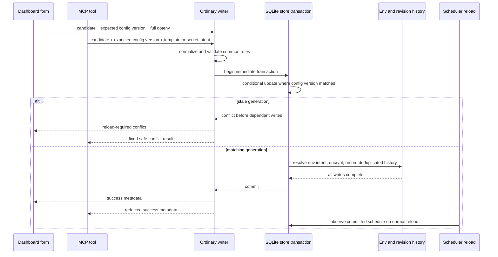

# Shared Service Write Contract - Plan

## Goal Capsule

- **Objective:** Operators and authorized MCP clients can change an ordinary service without one interface accepting stale, invalid, or partially persisted state that the other would reject.
- **Means:** Route every ordinary configuration and environment write through one revision-guarded transaction while keeping browser and MCP representations at their adapters. (KTD1, KTD2)
- **Authority:** The public issue and existing Nori security and persistence contracts define behavior. This plan only chooses how to preserve them.
- **Execution profile:** Implement and verify on `feat/shared-service-write-contract`, then propose the branch to `tomusdrw/nori` against `main`.
- **Stop conditions:** Stop for a product decision only if a required client compatibility trade-off cannot preserve stale-write protection. Do not broaden the launcher workflow, OAuth scope model, or deployment behavior.

---

## Product Contract

### Summary

Nori will give dashboard and MCP ordinary-service writes the same validation, conflict, and durability rules. The dashboard retains its authenticated plaintext editor. MCP retains placeholder templates and write-only secrets. Both update a durable generation so a client must reload after another committed write.

### Problem Frame

The dashboard still saves through an older path. Its form has no durable precondition, so a stale browser submission can overwrite a newer dashboard or MCP change. MCP has a transaction and an in-request conditional update, but it also lacks a client-supplied snapshot for stale reads. The split paths also duplicate validation, making equivalent requests behave differently.

### Actors

- A1. An authenticated Nori administrator editing an ordinary service in the dashboard.
- A2. An OAuth MCP client authorized with `nori:write`, and with `nori:secrets` only for literal secret writes.
- A3. The SQLite store, revision history, and scheduler that consume committed service configuration.
- A4. The launcher-managed Nori self-service, which remains a dashboard-and-launcher-only exception.

### Requirements

**Shared ordinary-service behavior**

- R1. Dashboard and MCP create and update flows for ordinary services must invoke one common write operation before durable state changes.
- R2. The operation must validate the effective service name, watched image, policy and schedule, deployment script, health URL, and environment document consistently for equivalent input.
- R3. A successful ordinary write must commit service fields, encrypted environment content, and their existing revision behavior as one outcome. Validation, encryption, history, database, cancellation, or commit failure must leave those durable values unchanged.
- R4. The dashboard must retain complete plaintext dotenv editing, including its formatting semantics. MCP must retain placeholder-template and write-only-secret semantics without returning literal values.

**Concurrency and recovery**

- R5. Every ordinary service or environment mutation must advance one durable configuration generation. A dashboard or MCP update must carry the generation it read, and a stale generation must fail without changing service fields, encrypted environment content, revision history, or schedules.
- R6. A conflict must tell the initiating interface to reload before retrying. The dashboard must render a non-secret recovery message, and MCP must return a fixed safe failure result with no request or stored secret content.
- R7. A committed policy or schedule change must remain visible to the scheduler on its existing reload cadence. Failed or conflicted writes must not reset, add, remove, or trigger a scheduled job.

**Protected boundaries**

- R8. The launcher-managed self-service must remain outside the ordinary write operation. MCP mutation and environment tools must continue rejecting it, while its dashboard/launcher path preserves protected image, handoff script, and environment behavior.

### Key Flows

- F1. Dashboard save
  - **Actors:** A1, A3.
  - **Steps:** The browser sends its edit generation with the full form. The adapter parses its transport-specific form representation, including line-ending handling; the shared operation then applies canonical candidate normalization and domain validation before it writes. The adapter renders either the committed service or a reload-required conflict.
  - **Outcome:** An accepted save is atomically durable. A stale or invalid save changes nothing.
- F2. MCP save
  - **Actors:** A2, A3.
  - **Steps:** The tool resolves omitted public fields against the read snapshot, sends the generation and an explicit template or secret intent to the shared operation, then redacts its result through the existing MCP wrapper.
  - **Outcome:** MCP sees the same domain outcome as the dashboard without gaining plaintext environment access.
- F3. Overlapping writes
  - **Actors:** A1 or A2, A3.
  - **Steps:** Two clients begin from generation `g`. The first transaction commits and advances it. The second conditional write sees no matching row and returns a conflict before environment or revision writes.
  - **Outcome:** The committed configuration remains authoritative and the losing client reloads.

### Acceptance Examples

- AE1. A valid ordinary service create or update with equivalent effective fields is accepted through both the dashboard and MCP. Covers R1, R2, R4.
- AE2. Invalid dotenv, Bash, schedule, image, or health input is rejected before any service, environment, history, or scheduler change. Covers R2, R3.
- AE3. A stale dashboard, stale MCP, dashboard-versus-MCP, or same-interface update cannot restore older service fields or environment contents. Covers R5, R6.
- AE4. An MCP template preserves existing secret values by key, and no literal environment value appears in MCP success or failure output. Covers R3, R4, R6.
- AE5. A committed scheduled-policy change is observed by the live scheduler, while a conflict leaves the existing entry and timing intact. Covers R7.
- AE6. Attempts to mutate the managed Nori self-service through MCP remain rejected, and the existing dashboard launcher flow still protects its managed fields. Covers R8.

### Scope Boundaries

- In scope: ordinary service create/update and existing MCP environment-template and secret mutations, common validation, generation-based conflict detection, transactional history and environment persistence, scheduler regression coverage, and MCP-safe failures.
- Out of scope: changing MCP tool scopes, exposing environment values, redesigning dashboard editors, replacing the scheduler, changing deployment execution, or introducing automatic last-writer-wins retries.
- Out of scope: making the launcher-managed Nori service an ordinary service, granting MCP access to its launcher configuration, or altering OAuth consent and authentication boundaries.

### Sources

- [Issue #24](https://github.com/tomusdrw/nori/issues/24)
- `docs/mcp.md` for MCP redaction, store, concurrency, scheduler, and self-service constraints.
- `internal/store/service_config.go`, `internal/store/env.go`, and `internal/store/revision.go` for the current atomic persistence and history behavior.
- `internal/web/server.go`, `internal/web/mcp.go`, and `internal/web/self_config.go` for adapter and launcher boundaries.

---

## Planning Contract

### Key Technical Decisions

- KTD1. **Use a service-level `config_version` as the public optimistic-concurrency precondition.** Add a migration-safe integer generation to `store.Service` and the `service` table, return it from service reads, require it on every ordinary update, and increment it only in the successful transaction. A version covers both public fields and encrypted environment state; `updated_at` has second precision and field-by-field comparison cannot represent a stale environment. Governs R3, R5, R6.
- KTD2. **Keep one application-level ordinary writer in `internal/web`, backed by store-owned transaction primitives.** Dashboard and MCP already share the `web` package, so a narrow writer there can own canonical candidate normalization, shared validation, input mode, and outcome classification without a new cross-package service layer. Adapters only parse their transport-specific representations: dashboard handling includes line endings, and MCP handling includes template decoding. The store remains responsible for all transaction-scoped reads, conditional updates, encryption, and revisions. Governs R1, R2, R3, R4.
- KTD3. **Acquire the SQLite write transaction up front and use the generation CAS before environment/history writes.** Configure the pinned SQLite driver for `BEGIN IMMEDIATE` write transactions, retain the existing per-connection busy timeout, and classify admission or commit contention as a safe temporary failure rather than success or conflict. Do not retry a failed statement or blindly replay a client command. Governs R3, R5, R6.
- KTD4. **Represent environment intent explicitly.** The shared writer accepts dashboard full-document input, MCP placeholder-template input, or a key-scoped MCP secret mutation, and resolves template/secret state only inside the transaction. Its returned outcome contains only public service metadata and stable error categories. Governs R2, R3, R4, R6.
- KTD5. **Treat the launcher as a protected exception.** The common writer rejects `IsSelf` before mutation. `saveSelfConfig` keeps coordinating the launcher file and compensating rollback, so it does not claim SQLite-only atomicity or expose launcher fields to MCP. Governs R8.
- KTD6. **Rely on committed store state for scheduler visibility.** The scheduler's one-second reload and queued-callback recheck already observe durable policy and cron values. The writer sends no scheduler event and never performs a scheduler action before commit. Governs R7.

### High-Level Technical Design

The adapters own authentication, CSRF, MCP scopes, form rendering, and MCP redaction. The writer owns only ordinary-service semantics. The launcher path never enters this sequence.

### Assumptions

- Existing clients can obtain the new generation from the read response before sending an update. The tool schemas and documentation will make that precondition explicit.
- `_txlock=immediate` is acceptable for this single-host SQLite application because write transactions remain short and do not perform network or launcher work.
- Existing direct `CreateService` and `UpdateService` calls remain bootstrap, migration, self-service, and test-fixture primitives. They do not become public ordinary-write adapters.

### System-Wide Impact

- **Persistence:** The service schema gains a migration-safe version column. Every ordinary config or environment write must advance it in the same transaction as data and history.
- **Dashboard:** Edit pages carry a hidden version. Conflict rendering must not echo submitted secrets or claim a successful save.
- **MCP:** Update and environment mutation inputs carry an expected version. The existing wrapper keeps scopes, audit logging, and cross-service redaction, while write failures use stable public messages.
- **Scheduler:** No scheduler API changes are needed. Its database reload remains the publication boundary after commit.
- **Launcher and OAuth:** Self-service and OAuth policy remain unchanged. Their current tests are regression gates because a generic writer must not bypass their guards.

### Risks and Mitigation

| Risk | Mitigation |
| --- | --- |
| A schema migration leaves an existing installation without a usable version. | Add the column with a non-null default, scan it on every service read, and cover an upgrade-shaped store test. |
| A template or secret mutation changes environment state without advancing the version. | Route each ordinary MCP environment mutation through the same transaction/CAS path and assert stale full-dashboard saves conflict. |
| SQLite contention is mislabeled as a successful or stale write. | Begin write transactions immediately, retain bounded busy waiting, return a stable temporary failure, and test independent database handles. |
| A generalized error/result leaks a secret. | Keep candidate/environment values out of outcome DTOs, use fixed MCP failure text, and inspect both MCP text and structured output with sentinels. |
| The generic path weakens launcher ownership. | Reject managed rows before ordinary mutation and retain self-environment regression tests. |

### Documentation Notes

Update `docs/mcp.md` to explain the configuration generation, mandatory read-before-update flow, conflict recovery, and unchanged placeholder/write-only-secret guarantees. Do not document private implementation workflow.

---

## Implementation Units

### U1. Add the durable configuration generation and transaction guard

- **Goal:** Make the store distinguish a current ordinary-service snapshot from a stale one across public fields and environment state.
- **Requirements:** R3, R5, R7.
- **Dependencies:** None.
- **Files:** `internal/store/models.go`, `internal/store/store.go`, `internal/store/service.go`, `internal/store/service_config.go`, `internal/store/env.go`, `internal/store/service_config_test.go`, `internal/store/env_test.go`, `internal/store/revision_test.go`.
- **Approach:**
  1. Add and migrate a non-null `config_version` field, expose it on service reads, and ensure ordinary config/environment writes advance it only after their expected generation matches.
  2. Keep all state-dependent environment reads, conditional service updates, encrypted writes, and revision inserts on one transaction-scoped handle.
  3. Configure short write transactions for immediate SQLite admission, normalize contention/cancellation as non-success outcomes, and preserve `ErrServiceConflict` for a failed generation predicate.
- **Patterns to follow:** `Store.SaveServiceConfig`'s rollback/commit shape, `writeEnvFile`'s encrypted deduplicated history behavior, and `migrate`'s additive schema checks.
- **Execution note:** Start with failing store tests for a stale environment snapshot and a stale metadata snapshot before changing the mutation APIs.
- **Test scenarios:**
  - A fresh versioned create and update advances the generation and stores no plaintext environment data.
  - A competing metadata or environment write makes an older expected generation return `ErrServiceConflict` before environment/history writes.
  - Covers AE3. A stale dashboard-equivalent full environment and a stale MCP-template update cannot restore the prior document or script.
  - Injected environment/history failure, canceled context, and failed commit leave service, environment, revisions, and generation unchanged.
  - Two file-backed store handles contend for a write without a partial commit or a false success.
  - Existing services upgrade with a valid default generation and preserve their readable configuration.
- **Verification:** Store tests prove every success writes one coherent versioned state and every failed precondition or transaction leaves the prior state intact.

### U2. Introduce the shared ordinary-service writer and validation contract

- **Goal:** Give dashboard and MCP adapters one common candidate-validation and persistence entry point without merging their environment representations.
- **Requirements:** R1, R2, R3, R4, R5, R6.
- **Dependencies:** U1.
- **Files:** `internal/web/service_write.go` (new), `internal/web/forms.go`, `internal/web/mcp.go`, `internal/web/service_write_test.go` (new), `internal/web/forms_test.go`.
- **Approach:**
  1. Define a narrow ordinary-write command with candidate service metadata, expected generation, and an explicit environment intent mode.
  2. Move name, image, policy, cron, size, newline, Bash, health, and dotenv validation behind that writer so both adapters receive the same category of result.
  3. Delegate template resolution, encryption, revisions, and generation comparison to U1's store operation, returning only typed outcomes and public metadata.
- **Patterns to follow:** `validateMCPService`'s current domain constraints, `validateServiceForm`'s editor-specific parsing, and `addNoriTool`'s redaction boundary.
- **Test scenarios:**
  - Covers AE1. Equivalent valid dashboard and MCP candidates produce the same persisted public service fields.
  - Covers AE2. Invalid name, reserved name, image, policy, cron, Bash, health URL, dotenv, oversized input, and newline cases are rejected by the common contract before a write.
  - Dashboard input retains comments and blank lines while MCP templates preserve declared secrets without retaining `[REDACTED]` as a literal.
  - A managed self-service candidate is rejected by the ordinary writer without attempting a store mutation.
  - A temporary store failure remains distinct from validation and conflict for adapter mapping, without exposing input values.
- **Verification:** Contract tests can exercise all input modes without an HTTP server and show that no adapter-specific validation branch decides ordinary persistence.

### U3. Make dashboard writes generation-aware and reload-safe

- **Goal:** Convert browser create/update requests into shared commands and give stale administrators a clear non-secret recovery action.
- **Requirements:** R1, R2, R4, R5, R6, R7, R8.
- **Dependencies:** U2.
- **Files:** `internal/web/server.go`, `internal/web/forms.go`, `internal/web/service_form.templ`, `internal/web/dashboard_test.go`, `internal/web/self_environment_test.go`, `internal/web/service_write_test.go`.
- **Approach:**
  1. Render and parse the current configuration generation for edits, while keeping create requests generation-free.
  2. Send ordinary dashboard form data to the shared writer. Map a stale outcome to an HTTP 409 form state with a fixed non-secret alert that says the configuration changed and provides a reload action to the GET edit URL; do not redirect for success or render submitted environment content in that response. Map a temporary outcome to a fixed non-secret retry alert with no success redirect; preserve the normal validation re-render path.
  3. Keep `saveSelfConfig` and its field forcing/launcher environment behavior on the managed branch instead of routing it through the ordinary writer.
- **Patterns to follow:** `parseServiceForm` newline normalization, existing `ServiceFormPage` error rendering, and `handleServiceUpdate`'s managed-service protection.
- **Test scenarios:**
  - A valid authenticated dashboard create/update saves a shared-contract candidate and redirects only after commit.
  - Covers AE2. An invalid form re-renders the submitted fields and leaves persisted config/environment/history unchanged.
  - Covers AE3. A form opened at an older generation receives the reload-required conflict after a newer dashboard or MCP write, leaving the newer state and scheduler entry intact.
  - A temporary store outcome renders the fixed retry alert without a redirect or submitted environment content, while a reload action shows the current generation and configuration.
  - Covers AE6. Dashboard self-service editing keeps the launcher-owned image/script and protected keys unchanged.
- **Verification:** HTTP-level tests prove form parsing, conflict recovery, and self-service routing without relying on browser-only `required` attributes.

### U4. Make MCP writes generation-aware and secret-safe

- **Goal:** Require MCP clients to use the read generation for ordinary configuration, template, and secret mutations while retaining the current scopes and redaction guarantees.
- **Requirements:** R1, R2, R3, R4, R5, R6, R8.
- **Dependencies:** U2.
- **Files:** `internal/web/mcp.go`, `internal/web/mcp_test.go`, `docs/mcp.md`.
- **Approach:**
  1. Add the expected generation to update, environment-template, and secret-mutation inputs, and expose the current generation in service reads and safe write results.
  2. Build MCP partial candidates from the supplied snapshot, then call the shared writer rather than directly selecting a template save method.
  3. Map validation, conflict, and temporary failures to stable MCP results before SDK serialization, leaving the existing wrapper to redact all text and structured output.
- **Patterns to follow:** `mcpService` managed-service guard, `mcpRedactor` refresh behavior, and real SDK-client tests in `TestMCPServiceLifecycleAndScopes`.
- **Test scenarios:**
  - An MCP client reads a generation, updates an ordinary service with it, and receives only safe metadata plus the next generation.
  - Covers AE4. Template and write-only-secret mutations preserve intended values without returning a sentinel secret in text, structured content, logs, validation errors, conflicts, or injected storage failures.
  - Covers AE3. A stale MCP update, template change, or secret mutation returns a conflict and writes no new revision.
  - MCP attempts against the managed self-service and its environment remain rejected before ordinary write handling.
  - Existing scope checks still require `nori:write` and `nori:secrets` for literal secret changes.
- **Verification:** A real MCP transport test covers the client-facing schema, failure shape, and complete response redaction.

### U5. Prove cross-surface concurrency, scheduler behavior, and documentation

- **Goal:** Demonstrate that the new contract protects durable state across interfaces and does not regress scheduler or launcher behavior.
- **Requirements:** R3, R5, R6, R7, R8.
- **Dependencies:** U1, U2, U3, U4.
- **Files:** `internal/web/service_write_test.go`, `internal/web/mcp_test.go`, `internal/scheduler/scheduler_test.go`, `internal/store/service_config_test.go`, `docs/mcp.md`.
- **Approach:**
  1. Coordinate dashboard and MCP writers from the same generation against a file-backed SQLite database, asserting one commit and one conflict without timing-dependent sleeps.
  2. Exercise a successful scheduled write through each adapter and a conflicted one against the existing scheduler reload behavior.
  3. Document the read-generation-update recovery sequence and retain the existing self-service and secret-handling boundaries.
- **Patterns to follow:** `TestReloadLiveServices`' preservation of unchanged cron entries, store trigger-based rollback tests, and `httptest` plus the real MCP SDK client.
- **Test scenarios:**
  - Covers AE3. Dashboard-versus-MCP and same-interface overlaps from one generation produce one winner, one conflict, one coherent generation advance, and no losing history or environment write.
  - Covers AE5. A committed schedule is observed on reload while a conflict leaves an existing `@every` entry's identity and timing unchanged.
  - Covers AE6. Existing self-service dashboard and MCP rejection tests pass unchanged after the shared writer is introduced.
  - The race-enabled suite detects no Go data race in the store/web/scheduler paths exercised by concurrent writes.
- **Verification:** Cross-surface tests prove the user-visible conflict contract and focused scheduler tests prove that transactional publication does not reset jobs.

---

## Verification Contract

| Gate | Evidence |
| --- | --- |
| Focused store and web behavior | `go test ./internal/store ./internal/web ./internal/scheduler ./internal/launcher` passes with the new parity, migration, atomicity, conflict, scheduler, and self-service cases. |
| Concurrent behavior | `go test -race ./internal/store ./internal/web ./internal/scheduler` passes using file-backed temporary databases and coordinated writers. |
| Repository suite | `make test` regenerates templ output and passes `go test ./...`. |
| Static checks and build | `go vet ./...` and `make build` pass. |
| Manual review | Inspect dashboard and MCP write failures for fixed, non-secret recovery text and confirm the diff leaves OAuth scopes, launcher mutation guards, and scheduler design unchanged. |

---

## Definition of Done

- U1 through U5 satisfy their listed test scenarios and verification outcomes.
- Dashboard and MCP ordinary writes share one validation and persistence contract, while their plaintext/template representations stay intentionally separate.
- A durable generation protects stale service and environment writes across interfaces, and a losing client must reload rather than overwrite or auto-retry.
- Every failed write leaves service data, encrypted environment data, revisions, and scheduler-visible state unchanged.
- MCP never serializes a literal environment value in successful or failed write results.
- The managed Nori self-service remains inaccessible to MCP mutation and keeps its launcher-backed dashboard workflow.
- Documentation explains the generation precondition and conflict recovery.
- No dead-end experimental code, duplicated write path, or generated artifact unrelated to the intended source changes remains in the branch.
